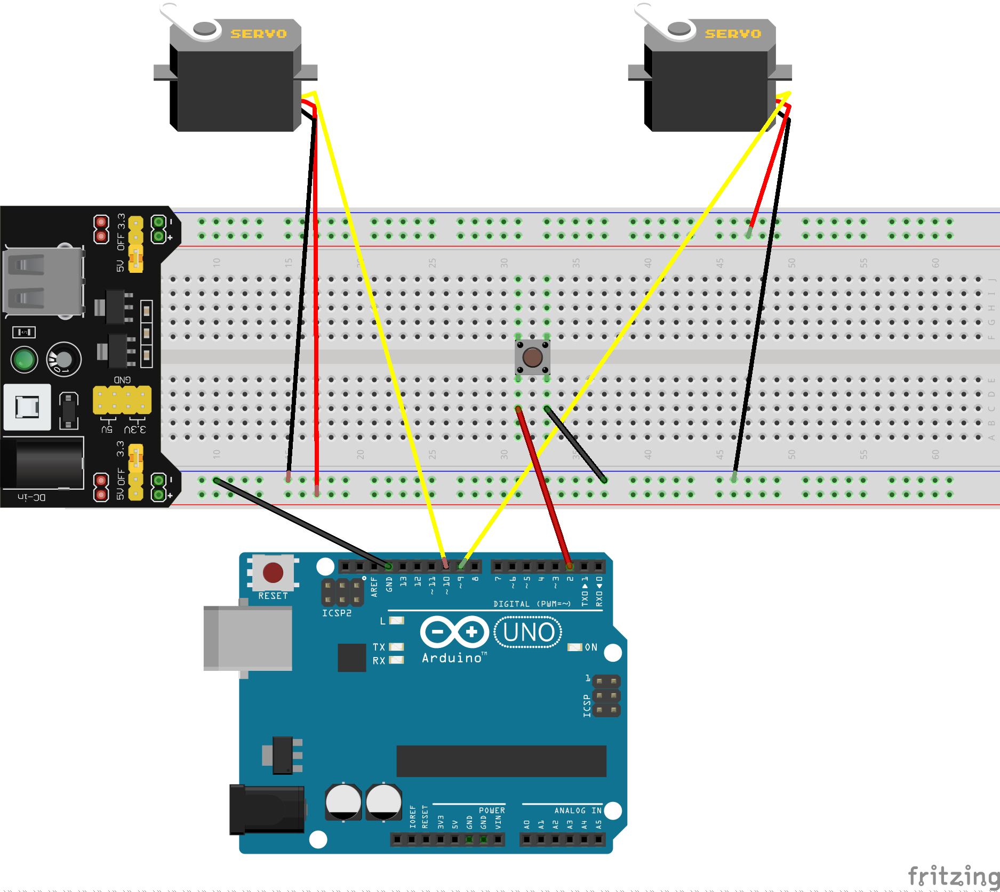

# TwoServoMotor

Arduino で **サーボモーターを2つ**、押しボタン1つで開閉するサンプルプログラムです。

ボタンを押すたびに、2つのサーボが同時に **0度（閉じ）** と **90度（開き）** を切り替わります。

## 用語の簡単な説明

| 用語 | 意味 |
|------|------|
| **Arduino** | プログラムを書いて動かす小型のマイコンボードです。このプロジェクトでは Arduino Uno R3 を想定しています。 |
| **サーボモーター** | 指定した角度まで回転できるモーターです。信号線・電源（赤）・GND（黒または茶）の3本線が一般的です。 |
| **ブレッドボード** | はんだ付けなしで部品や線をつなぐ板です。 |
| **GND** | 回路の「共通のマイナス（グラウンド）」です。Arduino とブレッドボードの GND をつなぐことで、正しく動作します。 |
| **デジタルピン** | Arduino 上の番号付き端子です。サーボやボタンの信号をここにつなぎます。 |

## 必要なもの

- Arduino Uno R3
- サーボモーター × 2
- 押しボタンスイッチ × 1
- フルサイズ ブレッドボード × 1
- ブレッドボード用電源モジュール × 1（サーボへの給電用）
- ジャンパー線（オス–オスなど）
- USB ケーブル（Arduino と PC の接続用）

**重要:** サーボモーターは電流を多く使うため、Arduino 本体の 5V ピンから直接給電しないでください。ブレッドボードの電源モジュール（外部電源）を使います。

## 回路図

次の図どおりに配線してください。

## 配線の手順

電源を入れる前に、次の順でつなぐと分かりやすいです。

### 1. 電源と GND（共通のマイナス）

1. ブレッドボードに電源モジュールを差し込み、電源を用意します（＋側と − 側のレールに電気が通ります）。
2. Arduino の **GND** と、ブレッドボードの **マイナス（青）レール** をジャンパー線でつなぎます。  
   → Arduino とサーボ・ボタンで「マイナス」を共有するため、必ずつなぎます。

### 2. サーボモーター1（左側）

| サーボの線 | つなぎ先 |
|------------|----------|
| 信号（黄またはオレンジ） | Arduino **デジタルピン 9** |
| 電源（赤） | ブレッドボードの **プラス（＋）レール** |
| GND（黒または茶） | ブレッドボードの **マイナス（−）レール** |

### 3. サーボモーター2（右側）

| サーボの線 | つなぎ先 |
|------------|----------|
| 信号（黄またはオレンジ） | Arduino **デジタルピン 10** |
| 電源（赤） | ブレッドボードの **プラス（＋）レール** |
| GND（黒または茶） | ブレッドボードの **マイナス（−）レール** |

### 4. 押しボタン

1. ボタンをブレッドボードの中央の溝をまたぐように差し込みます。
2. ボタンの一方を Arduino **デジタルピン 2** につなぎます。
3. ボタンのもう一方をブレッドボードの **マイナス（GND）レール** につなぎます。

プログラム側で Arduino の内部プルアップを使うため、ボタンを押すとピンが LOW になり、「押された」と判定されます。外付けの抵抗は不要です。

### 接続一覧（まとめ）

| 部品 | Arduino / 電源側 |
|------|------------------|
| サーボ1 信号 | ピン 9 |
| サーボ2 信号 | ピン 10 |
| ボタン | ピン 2（もう一方は GND） |
| サーボの電源 | ブレッドボードの外部電源（＋） |
| サーボの GND / ボタンの GND | ブレッドボードの GND（−） |
| Arduino GND | ブレッドボードの GND（−） |

## プログラムの動き

ソースコードは [two_servo_motor.ino](two_servo_motor.ino) です。

1. 起動時は「閉じ」状態（両サーボ **0度**）です。
2. ボタンを押すと、開閉状態が反転します。
3. **開き**のとき: 両サーボが **90度**
4. **閉じ**のとき: 両サーボが **0度**
5. 2つのサーボは常に同じ角度で動きます。

ボタンの接点が一瞬だけ振動する「チャタリング」による誤判定を減らすため、短い待ち時間を入れてから押下を確定しています。

## プログラムの書き込み方（Arduino IDE）

1. [Arduino IDE](https://www.arduino.cc/en/software) を PC にインストールします。
2. [two_servo_motor.ino](two_servo_motor.ino) を Arduino IDE で開きます。
3. メニューから次を選びます。
   - **ツール → ボード → Arduino Uno**（またはお使いの Uno 相当ボード）
   - **ツール → ポート →** 接続されている Arduino のポート
4. USB ケーブルで Arduino を PC に接続します。
5. 「書き込み」（アップロード）ボタンを押して、プログラムを Arduino に送ります。
6. ブレッドボードの電源モジュールの電源を入れ、ボタンを押してサーボが動くか確認します。

## 注意事項

- サーボは **Arduino の 5V から直接給電しない**でください。外部電源（ブレッドボード用電源モジュール）を使います。
- Arduino とブレッドボードの **GND は必ずつなぎ**ます。つながっていないとサーボやボタンが正しく動きません。
- 電源を入れる前に、配線が回路図と合っているかもう一度確認してください。
- サーボの角度（0度 / 90度）はプログラム内の数値で変えられます。機構に合わせて調整してください。
